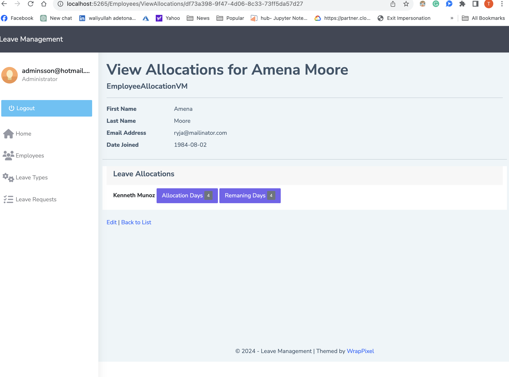

  <h2 align="center">LEAVE MANAGEMENT WEB APP</h2>
  

The Leave Management Web App is a comprehensive application designed for efficient leave request management within an organization. Employees can seamlessly apply for leaves based on the allocations provided by the admin. The app empowers administrators with the authority to review, approve, reject, or pend leave requests. Administrators can also modify, add, or delete leave types, ensuring flexibility in managing different types of leaves.
 

For employees, the app provides a user-friendly interface to view the number of allocated leaves personalized for each individual. This feature enhances transparency and allows employees to plan their time-off effectively. The Leave Management Web App streamlines the entire leave process, reducing paperwork and minimizing the administrative burden on both employees and administrators.

 

With its intuitive design and robust functionalities, this web app simplifies the leave management process, fostering a more organized and efficient work environment.

 

## LEAVE TYPES  AND ALLOCATE LEAVE  

 &nbsp; &nbsp; &nbsp; &nbsp; 

## LEAVE REQUEST AND  LEAVE ALLOCATIONS 

 &nbsp; &nbsp; &nbsp; &nbsp; 

## APPY FOR LEAVE AND VIEW ALLOCATIONS 

 &nbsp; &nbsp; &nbsp; &nbsp; 

## LEAVE DETAILS AND EDIT  

 &nbsp; &nbsp; &nbsp; &nbsp; 

<!-- TABLE OF CONTENTS -->
## Table of Contents

* [About the Project](#about-the-project)
* [Installation](#installation)
* [Built With](#built-with)
* [Nice to have features](#nice-to-have-features)
* [Contact](#authors)
* [Acknowledgements](#acknowledgments)

<!-- INSTALLATION -->

## Installation

To run the app locally, clone the repository, navigate to it's directory.

#### Follow these commands step by step:-

git clone `https://github.com/taiwo2/leaveManagementMVC` 

 

dotnet watch for the Backend(DOT.NET) 

Now go to [localhost:5265/](http://localhost:5265) in your browser.

<!-- BUILD WITH -->

## Built With

- HTML/CSS
- Javascript
- Font Awesome
- SweetAlert
- ASP.NET/C#

<!-- CONTACT -->
## Authors
👤 Taiwo Adetona

- Github: [@taiwo2](https://github.com/taiwo2)

- LinkedIn: [Taiwo Adetona](https://www.linkedin.com/in/taiwo-adetona/)

- Twitter: [@TaiwoAdetona4](https://twitter.com/TaiwoAdetona4/)

<!-- acknowledgments -->

## 🤝 Contributing

Contributions, issues and feature requests are welcome!

Feel free to check the [issues page](issues/).

## Show your support

Give a ⭐️ if you like this project!

## 📝 License

This project is [MIT](https://opensource.org/licenses/MIT) licensed.
